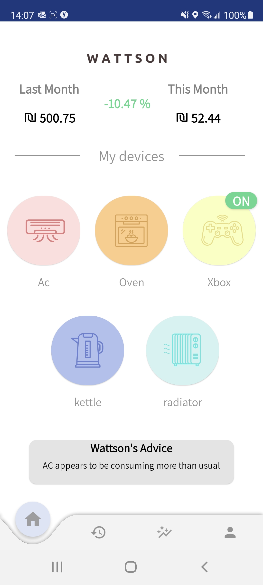
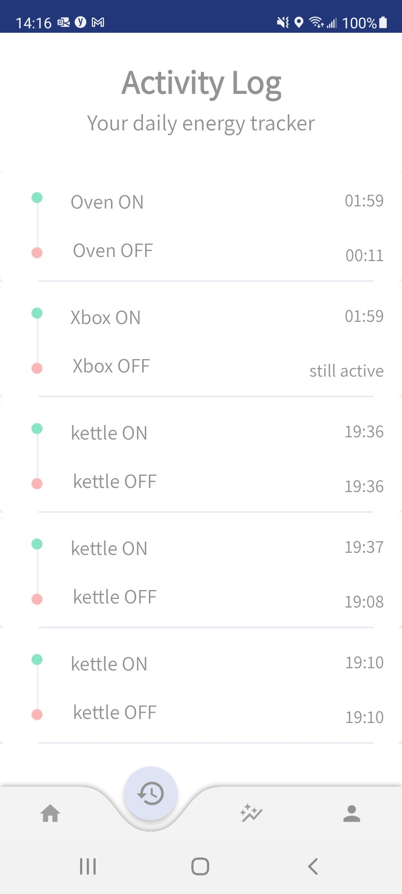
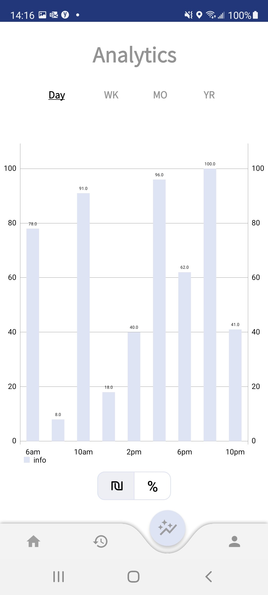
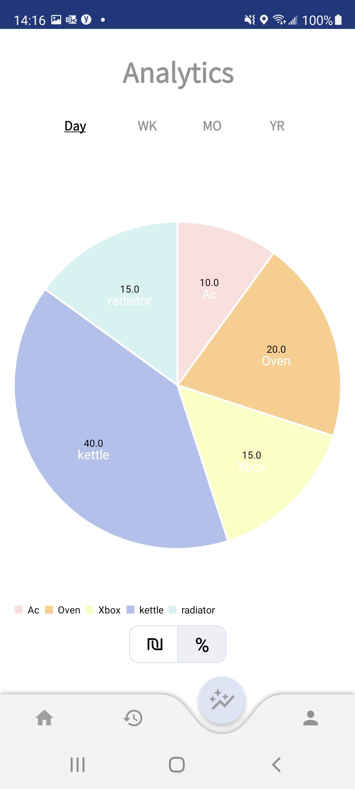

## **About Wattson:**

Wattson is a smart plug that measures electricity usage for better decision-making in consumption habits. The user can see in real time, the cost of their consumption habits. Our prediction tool helps users adjust habits to optimize on costs and environmental impact for their household.  

Wattson is a hardware/software IoT solution consisting of a smart-plug and mobile application. The smart plug component sits between the electrical appliance and the wall plug and constantly measures the electrical usage of the appliance. Data is then sent directly over wifi, even when the app is not currently running.

The Wattson app reads the usage data in real-time, allowing the user to make decisions based on real-time information on their electrical usage habits, such as the number of activations and running time of certain appliances, as well as estimations about future trends and costs. 
Wattson also allows the user to see their usage history. In addition to daily data, each appliance usage can show but also weekly, monthly and yearly usage habits!

> **_NOTE:_**  This is an MVP as part of the The Interdisciplinary Center Herzliya's Media Innovation Lab. Some features, such as log in authentication and logic are not implemented as we concentrated on building the product.
> 
> For more information visit http://milab.idc.ac.il/

 
 

 
 
 
 

## Our Product website:
https://shovalitzhak.wixsite.com/my-site

## Out Product blog:
https://shovalitzhak.wixsite.com/mysite-2

## Iot build:
The physical wall plug of the Wattson project, is composed of 2 main components:
1. [Usb Wemos D1 Mini Wifi Development Board ESP8266](https://www.aliexpress.com/item/4001086015049.html?spm=a2g0o.search0302.0.0.363f7f2dAcXiu7&algo_pvid=null&algo_expid=null&btsid=0b0a119a16238262925991431efd18&ws_ab_test=searchweb0_0,searchweb201602_,searchweb201603_) 
 - This component handles all the wifi transactions from the wall plug to the db and cellular application.
2. [Current Sensor ZMCT103C](https://www.aliexpress.com/item/32862297933.html?spm=a2g0o.detail.1000060.1.d20a5ec60YQSyb&gps-id=pcDetailBottomMoreThisSeller&scm=1007.13339.169870.0&scm_id=1007.13339.169870.0&scm-url=1007.13339.169870.0&pvid=6b5c2d4a-cead-4416-9fd5-34baef384384&_t=gps-id:pcDetailBottomMoreThisSeller,scm-url:1007.13339.169870.0,pvid:6b5c2d4a-cead-4416-9fd5-34baef384384,tpp_buckets:668%230%23131923%230_668%230%23131923%230_668%23888%233325%2313_668%23888%233325%2313_668%232846%238116%232002_668%235811%2327191%2396_668%232717%237561%23324_668%231000022185%231000066058%230_668%233468%2315607%2357_668%232846%238116%232002_668%235811%2327191%2396_668%232717%237561%23324_668%233164%239976%23645_668%233468%2315607%2357)
- This component is used to measue the current running through the plug. We then translate this into Watt and eventually into currency

## Creators:
#### Computer science students:
- Ofek Tavor - https://www.linkedin.com/in/ofek-tavor-a1a411197/
- Shai Brown - https://www.linkedin.com/in/shai-brown
#### Communication and Media studies students:
- Shoval Itzhak - https://www.linkedin.com/in/shoval-itzhak-2b79671a7/
- Adi Yakir
#### Psychology student:
- Liran Shati - https://www.linkedin.com/in/liran-shati-b054431b3/
